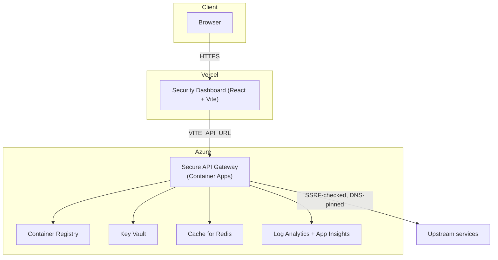

# Secure API Gateway — Multi-Cloud API Security Control Plane

A **production-grade API Gateway** in Fastify + TypeScript, in front of a genuine
**multi-cloud security detection and investigation control plane**: AWS CloudTrail and
GCP Cloud Logging feed live (Azure replay-only), gateway auth activity is monitored
directly, everything normalizes into one canonical event schema, gets evaluated
against documented detection rules, correlates into investigations with real evidence,
and can trigger real response actions — paired with a React reviewer dashboard, not
just a local demo.

**Why this exists**: most portfolio API projects stop at "it runs on my machine."
This one is meant to hold up to the questions a senior cloud/security engineer would
actually ask: *Where does this run? Who can access what, and how do you know? What
happens when a dependency fails? What's live versus replayed versus simulated, and how
would I tell? What's your story for secrets, for audit, for detection, for incident
response?* Every claim below is backed by code in this repo, not aspirational bullet
points — and where something genuinely isn't implemented yet, or is real-but-mocked
(e.g. the legacy incident playbook actions - see [Known limitations](docs/KNOWN_LIMITATIONS.md)),
it's called out explicitly instead of glossed over.

## Data provenance: live, replay, and synthetic

Every security event and every score in this system is tagged with where it actually
came from, and the UI/API never blur that distinction:

- **`live`** — a real event from a real source: AWS CloudTrail via CloudWatch Logs, GCP
  Cloud Logging, or the gateway's own auth activity (real HTTP requests hitting real
  rate limiting, real IP blocking, real audit hooks). Detection rules run against these
  the same way they run against everything else - no separate "demo" code path.
- **`replay`** — a sanitized, real-shaped fixture (e.g. a CloudTrail record) pushed
  through the exact same parse → normalize → detect → correlate pipeline as live
  traffic. Used where standing up a live AWS/GCP account isn't practical for a
  reviewer (Azure is replay-only; no live Sentinel/Monitor connector exists).
- **`synthetic`** — fabricated data, off by default (`ENABLE_SYNTHETIC_BACKGROUND_DATA=false`),
  used only to animate dashboard charts for local visual demos, and never allowed to
  feed detection, investigations, or compliance scoring.

See [`docs/CLOUD_INGESTION.md`](docs/CLOUD_INGESTION.md) for the pipeline this
provenance tagging runs through, and [`docs/KNOWN_LIMITATIONS.md`](docs/KNOWN_LIMITATIONS.md)
for every place a score or feature is real-but-partial (e.g. compliance scores that mix
live telemetry with fixed self-assessment, or backend endpoints that are intentionally
mocked) rather than fully live.

## Architecture



- **Frontend** (`dashboard/`) → **Vercel**. Static Vite build.
- **Backend** (`src/`) → **Azure Container Apps**, provisioned by [`terraform/`](terraform).
- **Local development** → Docker Compose, the one supported local path.

Full architecture detail (component breakdown, data flows, tech-stack rationale):
[`docs/ARCHITECTURE.md`](docs/ARCHITECTURE.md).

## Security features

### Authentication & authorization
- JWT access (15min) + refresh (7d) tokens, refresh rotation with **reuse detection**
  that revokes an entire token **family** (every token issued across that login's
  rotation chain), not just the reused one
- **Access-token revocation** on logout (Redis blacklist) — access tokens aren't just
  "wait for expiry"
- Role-based access control (RBAC) with granular permissions, enforced per-route
- **Scoped API keys** for machine-to-machine callers, independent of user RBAC,
  fully audited (create/revoke/use/invalid events)
- Account lockout after repeated failed logins (Redis-backed, IP+username keyed)

### Request-path security
- Redis-backed rate limiting — global (per-IP), per-route, per-user, and **per-API-key**,
  all correct across multiple gateway instances (this used to be a real bug: the
  route-level limiter was an in-memory `Map` that only worked by accident with one
  instance running)
- Explicit **CORS origin allowlist**, actually enforced (also a fixed bug — the CORS
  plugin was previously hardcoded to allow every origin regardless of config)
- Zod schema validation on every input, strips unknown keys (prototype-pollution
  defense)
- Security headers via Helmet (CSP, HSTS, X-Frame-Options, etc.)
- **SSRF protection**: hostname allowlist + private-IP blocking + **DNS-pinning** — the
  validated IP is what's actually dialed, closing a DNS-rebinding TOCTOU gap that
  existed before this pass
- **Circuit breaker** on upstream calls — fails fast instead of retrying into a
  cascading failure once an upstream is already down

### Auditability
- Structured security event log (login/logout, token events, permission denials, rate
  limit violations, SSRF blocks, API key lifecycle, …)
- **Tamper-evident hash chain** over the audit log (`GET /admin/audit-logs/verify`) —
  detects if a past entry was edited or deleted. Tamper-*evident*, not tamper-*proof*;
  see [`docs/SECURITY_CONTROLS.md`](docs/SECURITY_CONTROLS.md#roadmap) for what real
  immutability would take.
- Pino structured logging with field-level redaction (tokens/passwords never appear in
  logs)

### Detection, investigation, and multi-cloud ingestion
- **Canonical detection pipeline** (`src/modules/detection/`): documented rules with
  `id`/`severity`/`supportedProvenance`/`testPaths`/`evaluate()`, per-rule error
  isolation (one broken rule can't take down the others), and a runtime health tracker
  (evaluation/match/error counts) exposed via the API. Covers gateway credential
  attacks and JWT failure patterns (concentrated + distributed detection, deliberately
  excluding routine token expiry) plus AWS/GCP/Azure IAM and privilege-escalation
  patterns — see [`docs/DETECTION_RULES.md`](docs/DETECTION_RULES.md).
- **Investigations** (`src/modules/investigations/`): detections correlate into
  investigations by principal/resource/source-IP/account within a fixed time window -
  deterministic grouping, not an opaque risk score - each with a timeline, the raw
  normalized events and rule matches that produced it, and a downloadable evidence
  package. Correlation and event dedup are genuinely race-free under concurrent writers;
  see [`docs/CONCURRENCY.md`](docs/CONCURRENCY.md) for the Redis-atomicity design (and
  what's deliberately *not* covered yet).
- **Multi-cloud ingestion** (`src/modules/ingestion/`): AWS CloudTrail (via CloudWatch
  Logs) and GCP Cloud Logging poll live; Azure is replay-only. One pipeline
  (`ingestProviderEvent()`) handles live polling, replay fixtures, and guided
  scenarios identically - see [`docs/CLOUD_INGESTION.md`](docs/CLOUD_INGESTION.md) and
  the in-app Cloud Coverage page for current per-provider status.
- **Guided scenarios** (`src/modules/scenarios/`): reviewer-runnable, end-to-end
  demonstrations. The gateway credential-attack scenario drives real HTTP requests
  through the actual rate limiter and IP-block middleware (not a direct service-layer
  call) and verifies a genuine 403 + audit-log entry afterward, not just a Redis
  membership check.
- Per-IP threat scoring with attack-pattern detection (brute force, credential
  stuffing, rate-limit abuse) and AbuseIPDB reputation lookups —
  `src/modules/admin/threat-intel.service.ts`.
- Compliance posture scoring (NIST/OWASP/PCI/GDPR-oriented). Each framework's score now
  carries an explicit `assessmentBasis` (`partially-live` vs `static`) and note, shown
  in the dashboard, because most of PCI/OWASP/GDPR and 3 of 4 NIST controls are fixed
  self-assessments, not continuously measured — see
  [`docs/SECURITY_CONTROLS.md`](docs/SECURITY_CONTROLS.md#compliance-mapping).
- Live security dashboard: request/error rates, auth stats, rate-limit violations,
  response-time percentiles, streamed via SSE.

**What was removed, and why**: the dashboard's `/incidents` page (backed by
`src/modules/admin/incident-response.service.ts`) has been removed. It read from a
manual case-management system disconnected from the detection pipeline above, and its
"playbook actions" (disable user / block IP / open ticket) wrote a hardcoded
`result: 'mocked'` into the incident timeline without performing any real action - the
UI didn't visually distinguish that from genuine enforcement. The backend service and
its `/admin/incidents*` API still exist (still real: automatic escalation for
high/critical threat-intel scores) but are no longer reviewer-facing; Investigations
above is the current case-management surface, backed by real correlated detections and
real response actions. Full detail: [`docs/KNOWN_LIMITATIONS.md`](docs/KNOWN_LIMITATIONS.md).

See [`docs/THREAT_MODEL.md`](docs/THREAT_MODEL.md) for the attack-surface reasoning
behind these controls, and [`docs/SECURITY_CONTROLS.md`](docs/SECURITY_CONTROLS.md)
for the full control-to-implementation mapping (every row cites a real file).

## Local development

The one supported local path is Docker Compose:

```bash
git clone <repo-url> secure-api-gateway
cd secure-api-gateway
npm run seed          # generates JWT keys + .env from .env.example (scripts/dev-seed.sh)
docker compose up --build
```

- Gateway: http://localhost:3000 (Swagger UI at `/docs`, health at `/healthz`)
- Mock upstream service: http://localhost:4000
- Redis: `localhost:6379`
- Dashboard: http://localhost:5173

### Without Docker

```bash
npm run seed
npm install
docker run -d -p 6379:6379 redis:7-alpine   # Redis is required, no fallback mode
npm run dev
```

```bash
cd dashboard && npm install && npm run dev
```

Or use `make install && make dev` / `make docker-up` — see the [`Makefile`](Makefile)
for the full target list (npm scripts are the cross-platform primary; the Makefile is
optional sugar).

### Default users (dev only)

| Username | Password | Roles | Permissions |
|---|---|---|---|
| `admin` | `Admin123!` | `admin`, `user` | all |
| `user` | `User123!` | `user` | `read:reports` |
| `service` | `Service123!` | `service` | `read:reports`, `write:reports` |

Seeded in-memory for local development only — never present in the Azure deployment.

## API usage

```bash
# Login
curl -X POST http://localhost:3000/auth/login \
  -H "Content-Type: application/json" \
  -d '{"username": "admin", "password": "Admin123!"}'
# → { "accessToken": "...", "expiresIn": 900, "tokenType": "Bearer" }
# (refresh token set as an httpOnly cookie)

# Access a protected resource
curl http://localhost:3000/reports/123 -H "Authorization: Bearer <access-token>"

# Refresh
curl -X POST http://localhost:3000/auth/refresh --cookie "refreshToken=<...>"

# Create a scoped API key (admin)
curl -X POST http://localhost:3000/admin/api-keys \
  -H "Authorization: Bearer <admin-access-token>" \
  -H "Content-Type: application/json" \
  -d '{"name": "ci-pipeline", "scopes": ["proxy:access"]}'
# → { "apiKey": {...}, "rawKey": "gwk_..." }  (rawKey shown exactly once)

# Use the API key against the proxy endpoint
curl "http://localhost:3000/upstream/echo?message=hi" -H "X-API-Key: gwk_..."

# Verify the audit log hasn't been tampered with
curl http://localhost:3000/admin/audit-logs/verify -H "Authorization: Bearer <admin-access-token>"
```

Full OpenAPI spec: [`openapi/openapi.yaml`](openapi/openapi.yaml) (also served at
`/docs` when `ENABLE_SWAGGER=true`).

## Azure deployment

```bash
cd terraform
terraform init
cp environments/dev.tfvars.example environments/dev.tfvars   # set cors_origin at minimum
terraform apply -var-file=environments/dev.tfvars
```

This provisions everything — Container Registry, Key Vault (with real, generated
`cookie-secret`/`jwt-secret` written in as part of the apply, no manual seeding step),
Container Apps environment + the gateway app, Log Analytics + Application Insights,
and (optionally) Azure Cache for Redis. Then push the real image and point the app at
it:

```bash
ACR=$(terraform output -raw acr_login_server)
docker build -t "$ACR/secure-api-gateway:latest" .
az acr login --name "${ACR%%.*}"
docker push "$ACR/secure-api-gateway:latest"
az containerapp update -n "$(terraform output -raw container_app_name)" \
  -g "$(terraform output -raw resource_group_name)" --image "$ACR/secure-api-gateway:latest"
```

`.github/workflows/deploy.yml` automates this on `workflow_dispatch`. Full walkthrough,
remote state setup, secret rotation, and design notes (why the Container App uses a
user-assigned identity, why JWT is HS256 in this deployment):
[`terraform/README.md`](terraform/README.md).

Deploy the dashboard to Vercel separately — root directory `dashboard`, env var
`VITE_API_URL` set to the gateway's URL (`terraform output container_app_url`). See
[`dashboard/DEPLOYMENT.md`](dashboard/DEPLOYMENT.md). Prefer one cloud instead? Set
`enable_azure_static_web_app = true` in Terraform to host the dashboard on Azure
Static Web Apps — free tier, automatic HTTPS domain, no custom domain needed either
way. See [`terraform/README.md`](terraform/README.md#frontend-hosting-vercel-vs-azure-static-web-apps)
for the (two-step, one-time) manual GitHub secret/variable setup this still needs.

### Cost

| Resource | Monthly cost |
|---|---|
| Resource Group, Container Registry (Basic), Key Vault, Container Apps (scale-to-zero) | Free tier / consumption-priced, ~$0 at rest for a demo |
| Log Analytics + Application Insights | Free up to 5GB/mo (capped via `log_analytics_daily_quota_gb`) |
| **Azure Cache for Redis (Basic C0)** | **~$16/mo — the one unavoidable fixed cost** |
| API Management (optional, `enable_apim`) | ~$50+/mo, Developer SKU, no SLA — off by default |

Full breakdown: [`terraform/README.md`](terraform/README.md#what-gets-created-default-path).
Set `enable_redis = false` for a genuinely $0-at-rest deployment (documented degraded
mode, no fallback silently disables security controls — see
[`docs/OPERATIONS.md`](docs/OPERATIONS.md#redis-unavailability)).

## Environment variables

Full reference with defaults and validation rules: [`.env.example`](.env.example),
enforced by [`src/config/env.ts`](src/config/env.ts) (fails fast at startup — in
production specifically, refuses to boot with placeholder secrets, an unauthenticated
Redis, a wildcard CORS origin, or Swagger left enabled).

| Group | Key variables |
|---|---|
| Server | `NODE_ENV`, `PORT`, `HOST` |
| Redis | `REDIS_HOST`, `REDIS_PORT`, `REDIS_PASSWORD`, `REDIS_TLS` (required for Azure Cache for Redis) |
| Auth | `JWT_ALGORITHM`, `JWT_SECRET` / `JWT_PRIVATE_KEY`+`JWT_PUBLIC_KEY`, `COOKIE_SECRET`, `MAX_LOGIN_ATTEMPTS` |
| Rate limiting | `RATE_LIMIT_GLOBAL_MAX`, `RATE_LIMIT_AUTH_MAX`, `RATE_LIMIT_USER_MAX`, `RATE_LIMIT_APIKEY_MAX` (+ matching `_WINDOW` vars) |
| Security | `CORS_ORIGIN` (explicit allowlist, never `*` in production) |
| Upstream/SSRF | `UPSTREAM_REPORTS_URL`, `ALLOWED_UPSTREAM_HOSTS`, `CIRCUIT_BREAKER_FAILURE_THRESHOLD`, `CIRCUIT_BREAKER_COOLDOWN_MS` |
| Features | `ENABLE_SWAGGER`, `DEMO_MODE` |

## Testing

```bash
npm test              # full suite (backend needs Redis - see test/setup.ts)
npm run test:watch
npm run test:coverage
npm run lint
npm run typecheck
```

250+ tests across unit (RBAC, rate limiting, token rotation, API keys, audit hash
chain, SSRF/circuit breaker, CORS, validation, cloud event parsers, detection rules,
concurrency) and integration (auth flow, rate limit enforcement, CORS, cloud ingestion
pipelines, gateway detection, guided scenarios end-to-end) suites. CI
(`.github/workflows/ci.yml`) runs all of this plus a Redis service container on every
push/PR.

## CI/CD

| Workflow | What it does |
|---|---|
| `ci.yml` | Lint, typecheck, test (with Redis), build - backend, dashboard, mock-service |
| `docker.yml` | Builds both Dockerfiles, Trivy container scan → SARIF, blocks on CRITICAL |
| `terraform.yml` | `fmt -check`, `validate`, tfsec scan → SARIF, blocks on HIGH/CRITICAL |
| `codeql.yml` | CodeQL static analysis (JS/TS) → GitHub code scanning |
| `semgrep.yml` | Semgrep static analysis → GitHub code scanning |
| `sonarcloud.yml` | SonarCloud analysis (quality + security) |
| `dependency-review.yml` | Dependency Review (PRs), `npm audit`, SBOM generation |
| `deploy.yml` | Manual (`workflow_dispatch`): build → push to ACR → `az containerapp update` |
| `deploy-dashboard.yml` | Deploys the dashboard to Azure Static Web Apps when enabled |

All SARIF output uploads to GitHub code scanning. `deploy.yml` documents the exact
repo secrets it needs and an OIDC federated-credential setup (no long-lived Azure
secret) in its header comment.

## Project structure

```
secure-api-gateway/
├── src/
│   ├── config/env.ts        # Zod-validated, grouped config (server/auth/redis/...)
│   ├── lib/                 # crypto, logger, errors, circuit breaker, http client
│   ├── middleware/           # auth, rbac, rate limiting, validation, security headers, IP block
│   ├── modules/
│   │   ├── auth/             # login, refresh rotation, token store
│   │   ├── apikeys/           # scoped API keys
│   │   ├── audit/              # hash-chained audit log
│   │   ├── admin/               # metrics, threat intel, legacy incidents, compliance
│   │   ├── ingestion/            # canonical pipeline + AWS/GCP/Azure parsers + live adapters
│   │   ├── detection/             # detection rule engine, rule health, detection store
│   │   ├── investigations/         # correlation into investigations, evidence export
│   │   ├── security/                # capability registry, gateway auth/token detection
│   │   ├── scenarios/                # reviewer-runnable guided scenarios
│   │   ├── response/                  # real response actions (block IP, revoke sessions)
│   │   └── proxy/, reports/            # the actual gateway/proxy pattern
│   ├── app.ts / main.ts
├── dashboard/                # React + Vite reviewer dashboard → Vercel
├── mock-service/             # mock upstream for local dev/demo
├── terraform/                # Azure IaC + opt-in AWS/GCP ingestion identity (see terraform/README.md)
├── docs/                     # ARCHITECTURE, CLOUD_INGESTION, CONCURRENCY, DETECTION_RULES,
│                             # THREAT_MODEL, SECURITY_CONTROLS, OPERATIONS, INCIDENT_RESPONSE,
│                             # KNOWN_LIMITATIONS, PROXY_TRUST, owasp-api-top10, DEMO_WALKTHROUGH
├── .github/workflows/        # CI, Docker scan, Terraform scan, CodeQL, Semgrep, SonarCloud, deploy
└── legacy/deploy-configs/    # retired Fly.io/Railway/Render/self-host configs
```

## Roadmap

Honestly framed as not-yet-implemented, not partially faked — see
[`docs/SECURITY_CONTROLS.md#roadmap`](docs/SECURITY_CONTROLS.md#roadmap) for the
reasoning behind each:

- JWT key rotation via JWKS / multi-key support (currently a single static key)
- OpenTelemetry distributed tracing (currently request-ID correlation + App Insights)
- mTLS to upstream services
- Cryptographically anchored (not just chained) audit log
- MFA / WebAuthn for login
- Signed container image provenance (Sigstore/cosign)

## License

MIT — see [LICENSE](LICENSE).

---

Built to be read, not just run — every security claim above traces to a specific file.
Start with [`docs/THREAT_MODEL.md`](docs/THREAT_MODEL.md) if you want the "why" before
the "what", [`docs/DEMO_WALKTHROUGH.md`](docs/DEMO_WALKTHROUGH.md) for a guided tour of
the dashboard, or [`CHANGELOG.md`](CHANGELOG.md) for how this evolved into a
multi-cloud control plane.
