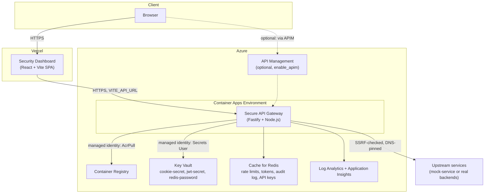

# Architecture

## Deployment architecture (Azure + Vercel)



The frontend and backend deploy independently and communicate only over HTTPS:
- **`dashboard/`** → Vercel by default. Static build, points at the gateway via
  `VITE_API_URL`. Optionally Azure Static Web Apps instead (`enable_azure_static_web_app`
  in Terraform) if you'd rather keep everything on one cloud - see
  [`terraform/README.md`](../terraform/README.md#frontend-hosting-vercel-vs-azure-static-web-apps).
  Both give you a public HTTPS domain automatically, no custom domain required.
- **everything else** → Azure, provisioned by [`terraform/`](../terraform). See
  [`terraform/README.md`](../terraform/README.md) for the resource-by-resource
  breakdown and cost table.

APIM is optional (`enable_apim` in Terraform, `false` by default) - see
[`terraform/README.md`](../terraform/README.md#optional-all-false-by-default) for why
it's not part of the default path. Without it, the Container App is directly
internet-facing; that's an intentional trust-boundary decision covered in
[`THREAT_MODEL.md`](THREAT_MODEL.md).

## Application architecture

The gateway follows a layered architecture with clear separation of concerns:

```
┌──────────────────────────────────────────────────────────────┐
│                     Client (Browser / API key holder)         │
└───────────────────────────┬─────────────────────────────────┘
                             │ HTTPS
┌───────────────────────────▼─────────────────────────────────┐
│                        API Gateway                            │
│                                                                 │
│  ┌───────────────────────────────────────────────────────┐   │
│  │  Middleware chain (ordered)                            │   │
│  ├───────────────────────────────────────────────────────┤   │
│  │  1. Request ID                                          │   │
│  │  2. Security headers (Helmet)                            │   │
│  │  3. CORS (explicit origin allowlist)                      │   │
│  │  4. Body parsing & size limit                              │   │
│  │  5. Global rate limit (Redis, per-IP)                       │   │
│  │  6. Route-specific rate limit (Redis, per-route/user/apikey) │   │
│  │  7. Request validation (Zod)                                  │   │
│  │  8. Authentication (JWT and/or scoped API key)                 │   │
│  │  9. Authorization (RBAC / API key scopes)                       │   │
│  │  10. Request logging                                              │   │
│  └───────────────────────────────────────────────────────┘   │
│                                                                 │
│  Routes: /auth/*  /admin/*  /reports/*  /upstream/*  /healthz  │
│                                                                 │
│  Business logic: auth, audit (hash-chained), API keys,          │
│  threat intel, compliance scoring, metrics, multi-cloud          │
│  ingestion → detection → investigation → response pipeline        │
└───────────────────┬─────────────────────┬───────────────────┘
                     │                     │
              ┌──────▼──────┐      ┌───────▼────────┐
              │    Redis    │      │ Upstream services│
              │             │      │ (SSRF-checked,    │
              │ rate limits │      │  DNS-pinned,        │
              │ tokens/keys │      │  circuit-breaker      │
              │ audit log   │      │  protected)            │
              └─────────────┘      └────────────────┘
```

### Component breakdown

- **`src/main.ts`** — entry point; graceful shutdown on SIGTERM/SIGINT.
- **`src/app.ts`** — builds the Fastify instance, registers plugins/middleware/routes,
  decorates shared services (`audit`, `metrics`, `tokenStore`, `apiKeyStore`) onto the
  app instance.
- **`src/config/env.ts`** — Zod-validated, grouped configuration (`env.server`,
  `env.auth`, `env.redis`, `env.security`, `env.upstream`, `env.rateLimit`,
  `env.features`, `env.observability`, `env.ingestion`, `env.storage`). Fails fast on
  missing/invalid config, and specifically refuses to boot in production with
  placeholder secrets, an unauthenticated Redis, a wildcard CORS origin, or Swagger
  left enabled.
- **`src/middleware/`** — request ID, security headers, CORS (via `@fastify/cors` in
  `app.ts`), rate limiting (Redis-backed, `src/middleware/rateLimit.ts`), JWT auth
  (`auth.ts`), RBAC (`rbac.ts`), validation (`validation.ts`).
- **`src/modules/auth/`** — login, refresh-token rotation with reuse detection and
  **token-family tracking** (a reuse event revokes every token - refresh and access -
  issued across that login's rotation chain, not just the reused one), account
  lockout, access-token revocation on logout.
- **`src/modules/apikeys/`** — scoped API keys as an alternative to JWT for
  machine-to-machine callers (`src/modules/proxy/proxy.routes.ts` accepts either).
- **`src/modules/audit/`** — hash-chained, tamper-evident audit log (`audit.hash.ts`);
  file store for dev, Redis for production.
- **`src/modules/admin/`** — metrics, threat intel scoring, AbuseIPDB integration,
  legacy incident-response API (superseded by Investigations, still used for automatic
  threat-intel escalation - see [`KNOWN_LIMITATIONS.md`](KNOWN_LIMITATIONS.md)),
  compliance scoring, audit log admin API.
- **`src/modules/ingestion/`** — the canonical security-event pipeline. Every source
  (live AWS/GCP polling, replay fixtures, guided scenarios) calls the same
  `ingestProviderEvent()` function: parse the provider-specific payload
  (`parsers/aws.parser.ts`, `parsers/gcp.parser.ts`, `parsers/azure.parser.ts`) into a
  canonical `NormalizedSecurityEvent`, redact sensitive fields, persist with
  provenance-aware dedup (`security-event.store.ts`), then hand off to detection and
  correlation - no separate "live" code path that skips steps. Two adapters poll live:
  AWS CloudWatch Logs and GCP Cloud Logging (`adapters/cloudwatch.adapter.ts`,
  `adapters/gcp-logging.adapter.ts`), tracking a Redis-backed cursor per adapter so a
  restart doesn't reprocess or lose events. Both are provisioned end-to-end by
  `terraform/modules/aws-logging` / `terraform/modules/gcp-logging` (opt-in,
  `enable_aws_cloudwatch_ingestion` / `enable_gcp_logging_ingestion` — see
  `terraform/README.md`), free at demo scale, with static (not federated) credentials -
  see [`CLOUD_INGESTION.md#minimal-iam-policy`](CLOUD_INGESTION.md#minimal-iam-policy).
  Azure is replay-only — no live Sentinel/Monitor connector is implemented, an
  intentionally undone roadmap item (no meaningful free tier at demo scale) rather than
  a gap; see [`SECURITY_CONTROLS.md`](SECURITY_CONTROLS.md#roadmap). A legacy, pre-unification
  event schema (`normalized-event.types.ts`) still exists in the codebase but nothing
  in the live/replay path calls into it anymore — see `KNOWN_LIMITATIONS.md`.
- **`src/modules/detection/`** — the detection rule engine: a `DetectionRule` interface
  (`id`/`severity`/`supportedProvenance`/`testPaths`/`evaluate()`), per-rule error
  isolation so one broken rule can't take down the others, and a runtime health
  tracker (evaluation/match/error counts, last-evaluated/matched timestamps) exposed
  via the API. See [`DETECTION_RULES.md`](DETECTION_RULES.md).
- **`src/modules/investigations/`** — correlates detections into investigations by
  principal/resource/source-IP/account within a fixed time window, with atomic,
  race-free dedup and correlation under concurrent writers (short-TTL token-based
  Redis locks, not `WATCH`/`MULTI`/`EXEC` - see [`CONCURRENCY.md`](CONCURRENCY.md) for
  why). Produces the timeline, evidence, and downloadable evidence package the
  Investigations dashboard page renders.
- **`src/modules/security/`** — the capability registry (single source of truth for
  what's live/replay/simulated/planned, exposed via API so docs and UI can't drift from
  it), plus gateway-specific detection wiring (credential-attack and JWT-failure
  tracking independent of the cloud parsers above).
- **`src/modules/scenarios/`** — reviewer-runnable guided scenarios. The gateway
  credential-attack scenario drives real `app.inject()` HTTP requests through the
  actual Fastify request lifecycle (rate limiting, IP-block middleware, audit hooks),
  not a direct service-layer call, and verifies enforcement with a genuine follow-up
  request and matching audit-log entry.
- **`src/modules/response/`** — real response actions (block IP, revoke sessions) that
  investigations and scenarios both call into.
- **`src/modules/proxy/`, `src/lib/httpClient.ts`** — the actual gateway/reverse-proxy
  pattern: SSRF-defended, DNS-pinned outbound requests with a per-host circuit breaker.
- **`src/lib/`** — crypto helpers, structured logging (Pino, with redaction), custom
  error classes, request context/correlation, the circuit breaker.

### Data flow: authentication

```
1. POST /auth/login { username, password }
2. Validate input (Zod) → check rate limit (Redis) → check lockout (Redis)
3. Verify password (bcrypt) → generate access + refresh JWTs, both tagged with a
   shared "family" ID
4. Store refresh token metadata + family membership (Redis) → set httpOnly refresh
   cookie → return access token
```

### Data flow: refresh & reuse detection

```
1. POST /auth/refresh (refresh cookie)
2. Verify JWT → check Redis blacklist → verify stored token hash matches
3. Hash mismatch (token reuse) → revoke the ENTIRE family (every access + refresh
   token ever issued in that login's rotation chain) → 401
4. Hash match → rotate: revoke old refresh token, issue new pair in the same family
```

### Data flow: proxied request (API key or JWT)

```
1. GET /upstream/echo, either Authorization: Bearer <jwt> or X-API-Key: gwk_...
2. Optional API key validated (if present) → optional JWT validated (if present)
3. Rate limit: per-API-key bucket if a key was used, else per-user/per-IP bucket
4. If API key used: require "proxy:access" scope
5. Circuit breaker check for the upstream host → SSRF-validate + DNS-pin the
   hostname → forward request → record success/failure on the circuit breaker
```

## Technology stack

| Layer | Choice | Why |
|---|---|---|
| Runtime | Node.js 20 LTS, TypeScript | Type safety, wide ecosystem |
| Framework | Fastify 5 | ~2x Express throughput, schema-first, first-class TS |
| Validation | Zod | Runtime type safety, strips unknown keys (prototype-pollution defense) |
| Auth | jsonwebtoken, bcrypt | JWT (HS256 in the Azure deployment, RS256 supported) + salted hashing |
| State | Redis (ioredis) | Rate limits, token/session state, audit log, API keys - stateless app, horizontally scalable |
| Outbound HTTP | undici (`Agent`/`Dispatcher`) | DNS-pinning for SSRF defense, not available via a bare `fetch()` call |
| Logging | Pino | Structured JSON logs with field-level redaction |
| Frontend | React + Vite | Fast dev loop, static output deploys cleanly to Vercel |
| IaC | Terraform, azurerm provider | Declarative, plan-before-apply, real diffable state |

## Scalability

- **Stateless app tier** — no in-memory session/rate-limit state (that was one of the
  real bugs fixed in this modernization pass - the route-level rate limiter used to be
  an in-memory `Map`, which only worked by accident with a single instance). All shared
  state lives in Redis, so the Container App can scale to N replicas safely.
- **Horizontal scaling** — `container_min_replicas`/`container_max_replicas` in
  Terraform; Container Apps' built-in HTTP-concurrency autoscaler.
- **Circuit breaker** — protects the app (and the upstream) from cascading failure
  when an upstream service degrades, independent of Container Apps' own scaling.

## Roadmap / not yet implemented

Documented honestly rather than partially faked - see
[`SECURITY_CONTROLS.md`](SECURITY_CONTROLS.md#roadmap) for the fuller list and reasoning:
- OpenTelemetry distributed tracing (currently: request-ID correlation + Application
  Insights via the Node SDK, not full OTel spans)
- JWT key rotation via JWKS / multi-key support (currently: single static key)
- mTLS to upstream services (currently: standard TLS; SSRF/DNS-pinning covers the
  outbound trust problem this deployment actually has)
- MFA / WebAuthn for user login
